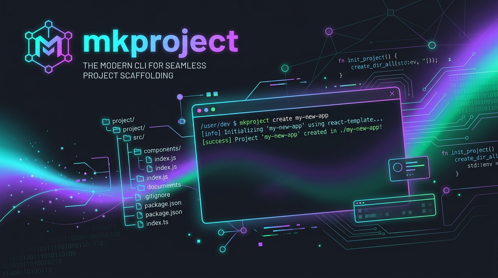

<div align="center">



# 🚀 `mkproject` (`create-project-directory`)

**Scaffold production-ready AI/ML, RAG, Backend, and Data Science project structures with a single command.**

[](https://www.python.org/)
[](https://opensource.org/licenses/MIT)
[](https://github.com/ravikumar-3481/pycli)
[](https://github.com/psf/black)
[](https://github.com/Textualize/rich)
[](CONTRIBUTING.md)

---

[⚡ Key Features](#-key-features) •
[📥 Installation](#-installation) •
[🎯 Usage](#-usage) •
[📁 Project Templates](#-supported-project-templates) •
[📚 Documentation](#-documentation-suite) •
[🤝 Contributing](#-contributing)

</div>

---

## ⚡ Key Features

- **⚡ Instant Scaffolding**: Build standardized, production-grade project folder structures in seconds.
- **🎯 Domain-Specific Templates**: Tailored templates for **AI/ML Pipelines**, **RAG Applications**, **Backend APIs**, and **Data Science**.
- **🎨 Interactive CLI Prompt**: Colorized selection menu powered by `Rich` if no flags are passed.
- **🛠️ Global Terminal Tool**: Install once via `pip` and run `mkproject` anywhere on your machine.
- **🛡️ Data Loss Prevention**: Skips non-empty existing files safely without overwriting your code.

---

## 📥 Installation

### Option 1: Install directly from GitHub (Recommended)

```bash
pip install git+https://github.com/ravikumar-3481/pycli.git
```

### Option 2: Install locally for development

```bash
git clone https://github.com/ravikumar-3481/pycli.git
cd pycli
pip install -e .
```

---

## Update Latest Version

```bash
pip install --upgrade git+https://github.com/ravikumar-3481/pycli.git
```


## 🎯 Usage

### 1. Direct Command with Template Flag (`-t` / `--type`)

Pass the project name and template key directly:

```bash
# 🤖 AI / Machine Learning Pipeline
mkproject my_ml_pipeline -t ai_ml

# 🔍 RAG (Retrieval-Augmented Generation) App
mkproject my_rag_app -t rag_based

# 🌐 Backend REST API Service
mkproject my_api_backend -t backend

# 📊 Data Science & Analytics
mkproject my_eda_project -t data_science
```

---

### 2. Interactive Menu Mode

Run `mkproject` without arguments to trigger the colorized interactive selection prompt:

```text
$ mkproject

Enter Project Name: enterprise-rag-system

Select Project Type:
  1. default - Default / Standard AI-ML Project Structure
  2. ai_ml - AI / ML Project (Data ingestion, training & prediction pipelines, models, notebooks)
  3. rag_based - RAG Based Project (Vector Store, Embeddings, Retrievers, Document Loaders, Prompts)
  4. backend - Backend API Project (FastAPI/Flask API routes, services, DB models, schemas, Docker)
  5. data_science - Data Science Project (EDA notebooks, visualizations, reports, data management)

Enter choice number or project type name [default: 1 (default)]: 3
```

---

## 📁 Supported Project Templates

| Template Flag `-t` | Domain | Key Scaffolding Modules Included |
| :--- | :--- | :--- |
| **`default`** | Baseline Standard | Workflows, `src/`, `config/`, `docs/`, `requirements.txt`, `README.md` |
| **`ai_ml`** | AI / ML Pipeline | Baseline + `data_ingestion`, `model_trainer`, `prediction_pipeline`, `notebooks/`, MLflow |
| **`rag_based`** | RAG / LLM App | Baseline + `vectordb`, `embeddings`, `loaders`, `retriever`, `prompts`, `evals` |
| **`backend`** | REST API Service | Baseline + `routes`, `controllers`, `services`, `schemas`, `db/models`, `Dockerfile`, `tests` |
| **`data_science`** | Data Analytics | Baseline + `data/external`, `data/interim`, `eda.ipynb`, `visualize.py`, `reports/` |

> 📖 Detailed file trees for each template are documented in [docs/TEMPLATES.md](docs/TEMPLATES.md).

---

## 📚 Documentation Suite

Explore our comprehensive documentation guides in the [`docs/`](docs/) directory:

- 🚀 [**Quick Start Guide** (`docs/QUICKSTART.md`)](docs/QUICKSTART.md): 2-minute setup guide and post-scaffolding workflows.
- 📖 [**CLI Reference Manual** (`docs/CLI_REFERENCE.md`)](docs/CLI_REFERENCE.md): Exhaustive parameters, flags, exit codes, and Windows setup.
- 📁 [**Templates Visual Guide** (`docs/TEMPLATES.md`)](docs/TEMPLATES.md): Visual diagrams, component trees, and recommended tech stacks.
- 🏗️ [**Architecture & Extension Guide** (`docs/ARCHITECTURE.md`)](docs/ARCHITECTURE.md): Internal code design and tutorial on creating custom templates.

---

## 🪟 Windows PATH Helper Script (`fix-path.ps1`)

On Windows, if running `mkproject` returns a term not recognized error, run the included helper script:

```powershell
.\fix-path.ps1
```

This automatically detects Python's `Scripts` folder and appends it to your User `PATH`.

---

## 🤝 Contributing

Contributions are welcome! Check out our [CONTRIBUTING.md](CONTRIBUTING.md) guide to get started with developer setup, testing, and pull requests.

---

## 📜 License

Distributed under the **MIT License**. See [`LICENSE`](LICENSE) for details.