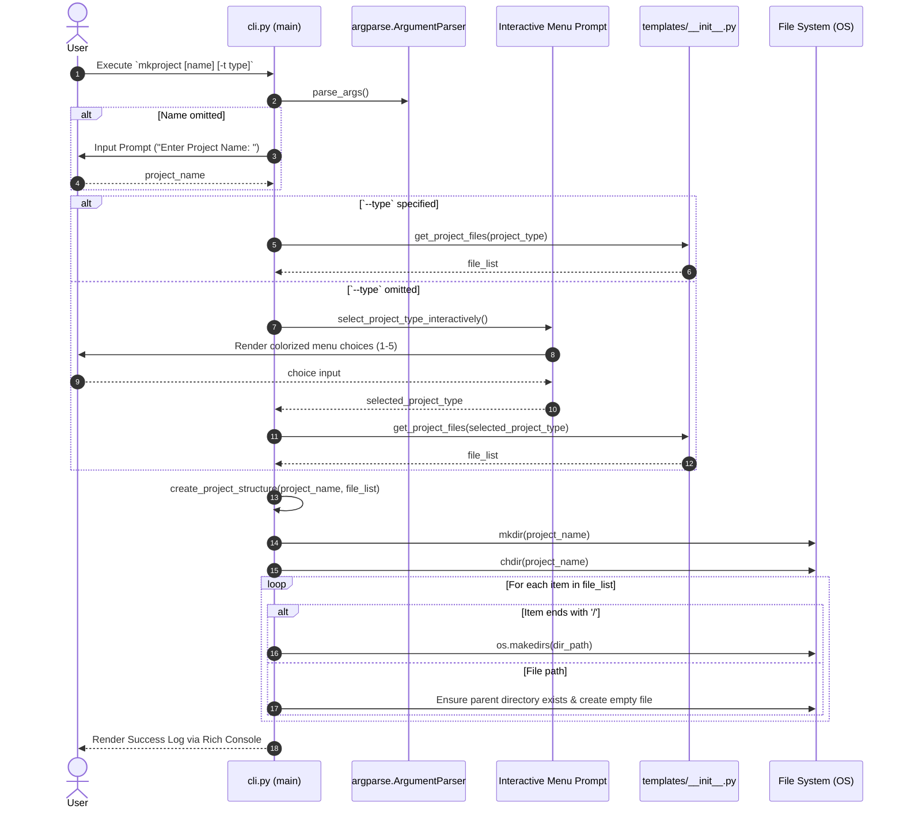

# 🏗️ Architecture & Extension Guide

Detailed technical architecture guide for **`mkproject`** (`create-project-directory`). This document covers code structure, execution sequence, and step-by-step instructions for adding custom templates.

---

## 🏛️ Code Structure Overview

`create-project-directory` is engineered as a modular, lightweight Python package:

```text
pycli/
├── pyproject.toml                # Build configuration & entry points (PEP 621)
├── README.md                     # Project overview & documentation link
├── docs/                         # Extended documentation suite
│   ├── assets/
│   │   └── banner.jpg            # High-resolution header graphic
│   ├── QUICKSTART.md             # 2-minute quickstart guide
│   ├── CLI_REFERENCE.md          # Command line flags reference
│   ├── TEMPLATES.md              # Template listings & component trees
│   └── ARCHITECTURE.md           # Architecture & extension guide (this file)
└── create_project_directory/     # Core package source code
    ├── __init__.py
    ├── cli.py                    # Main CLI interface, parser & directory generator
    └── templates/                # Modular template registry
        ├── __init__.py           # Registry dict & getter function
        ├── common.py             # Baseline shared file list (COMMON_FILES)
        ├── ai_ml.py              # AI/ML template definition
        ├── rag_based.py          # RAG template definition
        ├── backend.py            # Backend template definition
        └── data_science.py       # Data Science template definition
```

---

## 🔄 Execution Sequence Diagram

The diagram below details how `mkproject` parses arguments, resolves template files, and scaffolds the target project directory:



---

## 🛠️ Step-by-Step Tutorial: Adding a New Custom Template

Adding a new domain template (e.g. `devops` or `cybersecurity`) takes only **3 simple steps**:

### Step 1: Create a new template file inside `templates/`

Create a new Python file under `create_project_directory/templates/`:

```python
# create_project_directory/templates/devops.py
"""
DevOps & Infrastructure as Code (IaC) template files.
"""

from .common import COMMON_FILES

DEVOPS_FILES = COMMON_FILES + [
    "terraform/",
    "terraform/main.tf",
    "terraform/variables.tf",
    "terraform/outputs.tf",
    "ansible/",
    "ansible/playbook.yml",
    "k8s/",
    "k8s/deployment.yaml",
    "k8s/service.yaml",
    "k8s/ingress.yaml",
]
```

---

### Step 2: Register the template in `templates/__init__.py`

Import your new file array and add it to `PROJECT_TEMPLATES` and `PROJECT_DESCRIPTIONS`:

```python
# create_project_directory/templates/__init__.py
from .common import COMMON_FILES
from .ai_ml import AI_ML_FILES
from .rag_based import RAG_BASED_FILES
from .backend import BACKEND_FILES
from .data_science import DATA_SCIENCE_FILES
from .devops import DEVOPS_FILES  # <-- Add import

PROJECT_TEMPLATES = {
    "default": COMMON_FILES,
    "ai_ml": AI_ML_FILES,
    "rag_based": RAG_BASED_FILES,
    "backend": BACKEND_FILES,
    "data_science": DATA_SCIENCE_FILES,
    "devops": DEVOPS_FILES,        # <-- Add key
}

PROJECT_DESCRIPTIONS = {
    "default": "Default / Standard AI-ML Project Structure",
    "ai_ml": "AI / ML Project (Data ingestion, training & prediction pipelines, models, notebooks)",
    "rag_based": "RAG Based Project (Vector Store, Embeddings, Retrievers, Document Loaders, Prompts)",
    "backend": "Backend API Project (FastAPI/Flask API routes, services, DB models, schemas, Docker)",
    "data_science": "Data Science Project (EDA notebooks, visualizations, reports, data management)",
    "devops": "DevOps Project (Terraform IaC, Ansible Playbooks, Kubernetes Manifests)", # <-- Add description
}
```

---

### Step 3: Test your new template

Test creation using the new flag:

```bash
mkproject my_cluster_infra -t devops
```

`cli.py` automatically updates its `argparse` choices and interactive menu options directly from `PROJECT_TEMPLATES.keys()`. No modifications to `cli.py` are required!
