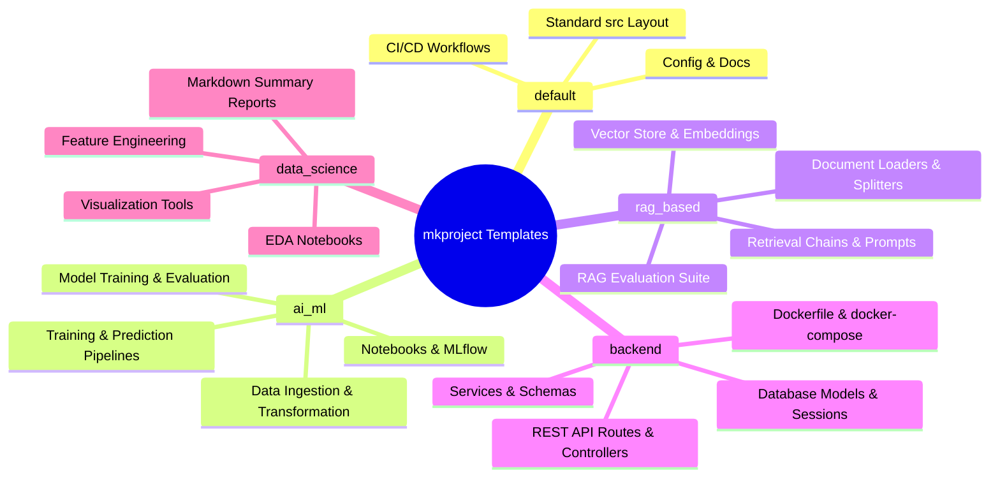

# 📁 Project Templates Visual Guide

`mkproject` provides tailored, production-ready directory and file scaffolding for distinct domain types. This document outlines the files, architecture, and recommended tech stack for each project template.

---

## 📊 Overview Matrix



---

## 1. ⚙️ `default` — Standard Baseline Template

The `default` template provides the baseline standard structure for Python applications. All other template types extend this baseline.

### 📌 Directory Tree:
```text
<project_name>/
├── .github/
│   └── workflows/
│       ├── ci-cd.yml             # Continuous Integration & Testing workflow
│       └── deploy.yml            # Deployment automation workflow
├── config/
│   ├── config.py                 # Configuration loader module
│   └── config.yaml               # YAML parameters file
├── data/
│   ├── raw/                      # Raw immutable data files
│   ├── processed/                # Cleaned/transformed data output
│   └── source.md                 # Data provenance documentation
├── docs/
│   ├── architecture.md           # High-level system architecture doc
│   ├── setup.md                  # Developer installation guide
│   ├── api.md                    # API specification doc
│   ├── requirements/
│   │   ├── prd.md                # Product Requirements Document
│   │   └── trd.md                # Technical Requirements Document
│   └── decisions/
│       └── decision.md           # Architecture Decision Records (ADR)
├── logs/                         # Runtime application logs directory
├── research/                     # Experimental scratch scripts & research
├── templates/                    # HTML / Jinja rendering templates
├── src/
│   ├── __init__.py
│   ├── api/__init__.py           # API endpoints & controllers
│   ├── cache/__init__.py         # Caching mechanisms (Redis/In-memory)
│   ├── components/__init__.py     # Core application components
│   ├── config/
│   │   ├── __init__.py
│   │   └── configuration.py      # App settings & config parser
│   ├── constants/__init__.py     # Constant variables & literals
│   ├── core/__init__.py          # Core business logic
│   ├── entity/__init__.py        # Data entities & dataclasses
│   ├── features/__init__.py      # Feature modules
│   ├── pipeline/__init__.py      # Execution pipelines
│   └── utils/__init__.py         # Helper utilities & loggers
├── .env                          # Local environment secrets (git-ignored)
├── .env.example                  # Environment template for team
├── .gitignore                    # Git ignore rules
├── README.md                     # Project documentation
├── dvc.yaml                      # Data Version Control configuration
├── params.yaml                   # Model hyperparameter file
├── requirements.txt              # Dependencies list
└── setup.py                      # Package installation script
```

---

## 2. 🤖 `ai_ml` — Machine Learning Pipeline Template

Designed for end-to-end Machine Learning pipelines with dedicated data ingestion, training, evaluation modules, MLflow configuration, and experimentation notebooks.

### 🛠️ Recommended Tech Stack:
- **ML Frameworks**: `scikit-learn`, `PyTorch`, `LightGBM`, `XGBoost`
- **Experiment Tracking**: `mlflow`, `wandb`
- **Data Versioning**: `dvc`

### ➕ Additional Structure:
```text
src/
├── data/
│   ├── __init__.py
│   ├── data_ingestion.py        # Fetches raw data from database/API/GCS/S3
│   └── data_transformation.py   # Cleans, imputes, and scales features
├── models/
│   ├── __init__.py
│   ├── model_trainer.py         # Model architecture & training execution
│   └── model_evaluation.py      # Metrics computation (ROC-AUC, RMSE, F1)
└── pipelines/
    ├── __init__.py
    ├── training_pipeline.py     # End-to-end training pipeline orchestrator
    └── prediction_pipeline.py   # Batch/real-time inference handler
notebooks/
├── 01_eda.ipynb                 # Exploratory Data Analysis notebook
└── 02_model_experimentation.ipynb # Model benchmarking notebook
artifacts/                        # Saved model artifacts (.pkl, .onnx, .pt)
mlflow_config.yaml                # MLflow tracking server setup
```

---

## 3. 🔍 `rag_based` — RAG / LLM Application Template

Designed for Retrieval-Augmented Generation (RAG) applications using vector databases, embeddings, chunking, retrieval chains, prompt management, and evaluation.

### 🛠️ Recommended Tech Stack:
- **LLM Frameworks**: `LangChain`, `LlamaIndex`, `Haystack`
- **Vector DBs**: `ChromaDB`, `Qdrant`, `FAISS`, `Pinecone`
- **LLM APIs**: `OpenAI`, `Anthropic`, `Google Gemini`, `HuggingFace`
- **Evaluation**: `Ragas`, `TruLens`

### ➕ Additional Structure:
```text
data/
├── documents/                    # Source PDF/TXT/Markdown documents
└── vector_store/                 # Local vector database index storage
src/
├── vectordb/
│   ├── __init__.py
│   └── vector_store.py           # Vector database collection manager
├── embeddings/
│   ├── __init__.py
│   └── embedder.py               # Embedding model provider wrapper
├── loaders/
│   ├── __init__.py
│   └── document_loader.py       # PDF/HTML/CSV ingestion loaders
├── text_splitter/
│   ├── __init__.py
│   └── splitter.py               # Recursive/semantic text chunker
├── retriever/
│   ├── __init__.py
│   └── retrieval_chain.py       # Hybrid BM25 + Dense vector retriever
├── prompts/
│   ├── __init__.py
│   └── prompt_templates.py      # System prompt templates & guardrails
└── llm/
    ├── __init__.py
    └── llm_provider.py           # Unified LLM provider wrapper
evals/
├── __init__.py
└── rag_eval.py                   # Context precision/recall evaluation script
```

---

## 4. 🌐 `backend` — Backend API Service Template

Designed for RESTful web backend API services (FastAPI/Flask/Django) with layered controllers, service layer, ORM database models, Pydantic schemas, tests, and Docker containerization.

### 🛠️ Recommended Tech Stack:
- **Web Frameworks**: `FastAPI`, `Flask`, `Django`
- **ORM & DB**: `SQLAlchemy`, `Alembic`, `PostgreSQL`, `SQLite`
- **Validation**: `Pydantic v2`
- **Testing**: `pytest`, `httpx`

### ➕ Additional Structure:
```text
src/
├── main.py                       # Application entry point (FastAPI/Flask instance)
├── controllers/__init__.py       # Request handlers
├── routes/
│   ├── __init__.py
│   └── api_v1.py                 # REST API endpoints routing
├── services/
│   ├── __init__.py
│   └── base_service.py           # Business logic service layer
├── schemas/
│   ├── __init__.py
│   └── request_response.py       # Pydantic request/response schemas
├── db/
│   ├── __init__.py
│   ├── session.py                # Database connection & session maker
│   └── models.py                 # SQLAlchemy ORM data models
└── middlewares/
    ├── __init__.py
    ├── auth.py                   # JWT Authentication middleware
    └── cors.py                   # CORS policy configuration
tests/
├── __init__.py
├── conftest.py                   # Pytest fixtures & test database setup
└── test_api.py                   # API endpoint tests
Dockerfile                        # Multi-stage production Docker build
docker-compose.yml                # App + DB services container composition
```

---

## 5. 📊 `data_science` — Data Science Analytics Template

Designed for exploratory data analysis (EDA), data processing scripts, visualization helpers, and markdown summary reports.

### 🛠️ Recommended Tech Stack:
- **Analytics**: `pandas`, `polars`, `numpy`, `scipy`
- **Visualization**: `matplotlib`, `seaborn`, `plotly`
- **Notebooks**: `JupyterLab`, `Marimo`

### ➕ Additional Structure:
```text
data/
├── external/                     # Data from third-party sources
└── interim/                      # Intermediate transformed data
notebooks/
├── 01_eda.ipynb                 # Distribution & correlation analysis
├── 02_feature_engineering.ipynb # Feature creation notebook
└── 03_modeling.ipynb            # Statistical modeling notebook
reports/
├── figures/                      # High-resolution generated plots & charts
└── summary_report.md             # Executive analytical findings report
src/
├── data/
│   └── make_dataset.py           # Data downloading & clean script
├── features/
│   └── build_features.py         # Feature calculation functions
└── visualization/
    ├── __init__.py
    └── visualize.py              # Custom plot formatting utilities
```
